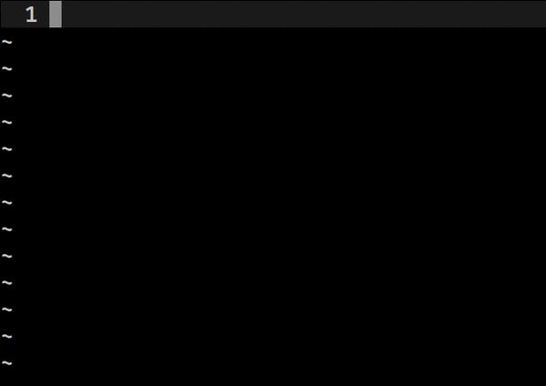

gustav.vim
==========
A lean and mean [GitHub Flavored Markdown][1] _compatible_ task/todo manager.



Usage
-----
Copy `plugin/gustav.vim` to `~/.vim/plugin/gustav.vim`.

Add the _mappings_ to your `~/.vimrc`.

```vim
noremap <Leader>- :call gustav#add()<CR>
noremap <Leader>= :call gustav#toggle()<CR>
```

Contribute
----------
* Fork the project.
* Make your feature addition or bug fix.
* Do **not** bump the version number.
* Send me a pull request. Bonus points for topic branches.

License
-------
Copyright (c) Mihail Szabolcs. Distributed under the same terms as Vim itself. See
:help license.

[1]: https://github.github.com/gfm/
